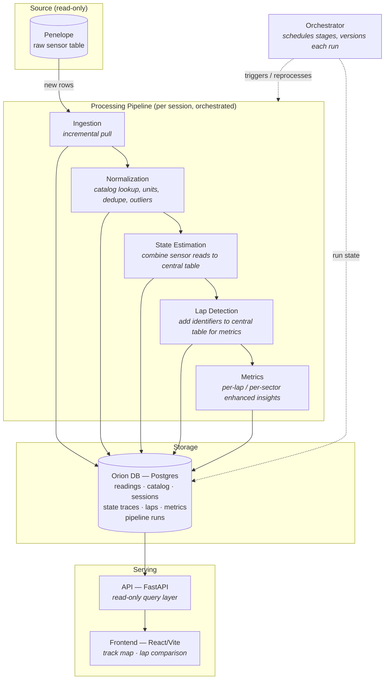
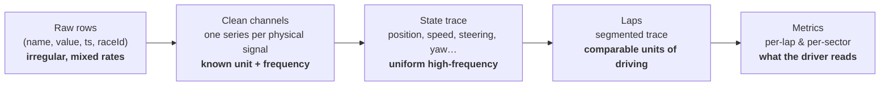

# Architecture Plan

Hello squad, here is Jacob and I's initial plan for what our codebase might look like. This doc exists to give everyone an undeerstanding of what each piece of the software we are working on looks like (and to prevent spaghetti code). 

We want to clarify that this is **not** set in stone and will likely change. Further, if you have an idea or concern about the design of the project say something! The first idea is usually not the best, lets all discuss and find the best path.

---

## Databases

**Penelope (source, read-only).** NER's existing Postgres table of every published sensor reading. For our purposes it ia read-only and should be a one-time pipeline query.

**Orion DB (Postgres, ours).** The single system of record for everything we derive:
- Mirrored raw readings from penelope.
- Processed data tables storing state estimates, laps, metrics, and pipeline run history. 
- Time-series tables get partitioned by session so one race's data can be scanned or reprocessed independently.
- State-estimate traces live here, as a wide table — one row per timestep, one column per channel.

---

## Services & Pipeline

### Ingestion Service
**IN**: Penelope Credentials
**OUT**: Raw sensor data from Penelope (one sensor read per row)

Client connected to `Penelope`. Owns the connection to NER's data. Incrementally intakes NER's data tables only intaking new records.

### Normalization Service
**IN**: Raw sensor data from Penelope
**OUT**: Cleaned sensor data, converted into our own data structure.

Resolves raw sensor inputs against mapping catalog, converts units, drops duplicates, and rejects out-of-range readings. 
Output is a set of clean, per-channel time series with
known frequencies.

### State Estimation Service *(the hard part)*
**IN**: Clean sensor data
**OUT**: Estimated reading of every car metric at 100hz. (Wide dataframe)

Utilizes statical and/or ML methods to create a prediction of every metric of the car at 100 readings/s. This is difficult because different sensors update at different frequencies (e.g GPS updates once/s v.s. accelerometer updates 20/s). Fills in the gaps to estimate a comprehensive picture of the car at every point.

### Lap Detection Service
**IN**: Car estimation data.
**OUT**: Car estimatation data with LAP identifications 

Intakes the wide frame of car readings at each timestamp. Adds lap IDs to each metric point to allow quick querying of information lap by lap.

### Metrics Service
**IN**: Car estimation data with LAP Ids
**OUT**: TBD

We will need talk more with NER to figure out what metrics will be identified exactly. But we will want to collect data to examine the car's performace lap-by-lap. Likely will include speed (duh) and batter usage.

### Orchestrator
Owns the pipeline service and writes to OrionDB. The orchestrator is in charge of running the ingestion from Penelope all the way through Metric Service. Will need to be able to run the pipeline incrementally and handle failures/restarts along the way.

### Backend Service (FastAPI)
Serves sessions, laps, metrics, and downsampled traces to the frontend over a read-only query layer. It reads only from Orion DB (will never trigger the ingestion pipeline)

### Frontend (React)
Session browser, a track map with the reconstructed racing line, and lap-vs-lap comparison charts for speed, battery usage, and time. 

Built driver-first: the default
view answers "which lap was my best and where were the rest slower."

---

## Pipeline Diagram

### Data shape at each hop

